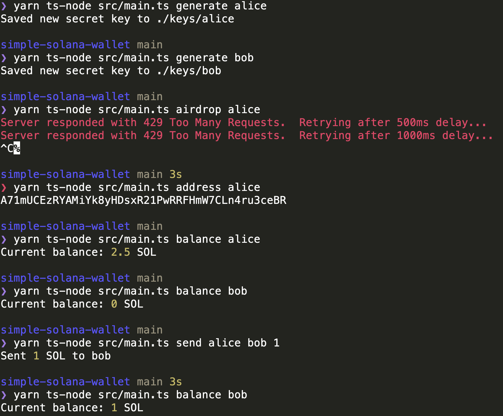

# simple-solana-wallet

simple command line tool for doing stuff on solana

# Installation

Clone this repo
Run `yarn reinstall`

# Running from code:

```
  yarn
  yarn node-ts src/main.ts <command> <options>
```

## Commands

generate: `generate <name>`

address: `address <name>`

balance: `balance <name>`

airdrop `airdrop <name>`

send: `send <name> <destination> <amount>`

mint: `mint <minter> <amount> <name>`

sendSpl: `sendSpl <sender> <destination> <amount> <name>`

# Example
Below you can see how to create two keys (`alice` and `bob`) and send SOL between them

If you are getting errors from the `airdrop` command, you can use `address <name>` to get the address and use it at https://faucet.solana.com/ to get an airdrop


